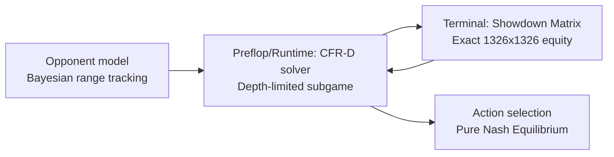

# Heads-Up No-Limit Texas Hold'em / CFR-D Solver

**Live demo:** [poker.georgez.xyz](https://poker.georgez.xyz)

Heads-up NLHE is one of the canonical benchmark problems in game-theoretic AI.
The game tree has around 10^160 possible states, which rules out exact solving.
This project implements depth-limited CFR-D (Counterfactual Regret Decomposition)
with an exact equity-based value function to compute approximate Nash equilibrium
strategies in real time. It consistently beats professional benchmark bots like
Slumbot, achieving a win rate of +194 mbb/hand over a 500-hand sample.

**Play it live:** [https://poker.georgez.xyz]

## How It Works



The bot solves the game tree dynamically in real time:

**True Public State CFR.** The solver implements a two-pass top-down and bottom-up
public state CFR. It tracks hero and opponent reach probabilities down every branch,
forcing the simulated opponent into a true Nash equilibrium response.

**Exact Terminal Showdown Matrix.** To evaluate leaf nodes accurately without
Monte Carlo noise, the solver dynamically maps precomputed exact equities into a
perfect 1326x1326 matrix. Terminal nodes evaluate expected value via rapid
matrix-vector multiplications.

**Stable Cross-Street Bayesian Tracking.** The opponent's range is tracked across
streets using a hand-strength-based Bayesian model. The solver narrows its own
phantom range based on pot commitment, forcing the opponent to respect represented
strength and preventing maniacal bluffs.

**Game-Theoretic Action Abstraction.** To protect the 1-street depth limit from
check-down exploits, the bot implements a dynamic action abstraction similar to
professional solvers. Massive overbets are filtered out early in the hand when
the Stack-to-Pot Ratio is high, keeping the game tree realistic.

## Key Algorithms

**CFR-D (Counterfactual Regret Decomposition)**
At each decision node, the solver maintains a regret value for each action. After
each iteration, the strategy puts weight proportional to positive regrets. Over
time this converges to a Nash equilibrium by the regret-matching theorem.

**Vectorized Matrix Math**
Inner loops of the CFR iterations are completely vectorized. Showdown evaluation
is reduced to a clean dot product against the reach probabilities of the
opposing player.

**Bayesian range updates**
When the opponent acts, their range is updated multiplicatively: range[h] *=
P(action | h). This is a discrete Bayesian filter that concentrates probability
mass on hands consistent with observed behavior.

## Project Structure

```
nlhe/
  game.py           standalone NLHE engine
  bot.py            Bot class: new_hand / observe_action / decide
  cfr/
    solver.py       CFR-D solver (True public state, vectorized loops)
    equity.py       equity calculator and 1326x1326 matrix builder
    abstraction.py  hand bucketing + dynamic action abstraction
    opponent.py     Bayesian cross-street range model
    tables/
      equity_matrix_169.npy   pre-solved exact Monte Carlo equity (committed)
  demo/
    app.py          Streamlit app
report.ipynb        technical report: convergence, validation, finance connections
```

## Technical Report

`report.ipynb` covers:
* CFR convergence curves
* Equity calculator validation
* Bot vs baselines: random, always-call, always-all-in
* Connections to no-regret learning, optimal execution, and Bayesian filtering

## Running Locally

```bash
pip install -r requirements.txt
streamlit run nlhe/demo/app.py
```

## Origin

This solver was first built for a custom 27-card Trips Poker variant at the CMU
AI Poker Tournament. The CFR-D architecture generalized to standard NLHE with
minimal changes: the regret-matching core is game-agnostic, and only the hand
indexing layer and terminal value function needed to be rebuilt.
