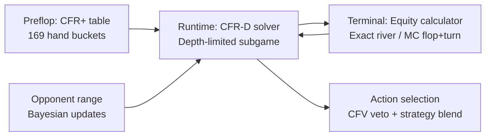

# Heads-Up No-Limit Texas Hold'em / CFR-D Solver

[](STREAMLIT_URL_HERE)

Heads-up NLHE is one of the canonical benchmark problems in game-theoretic AI.
The game tree has around 10^160 possible states, which rules out exact solving.
This project implements depth-limited CFR-D (Counterfactual Regret Decomposition)
with an equity-based value function to compute approximate Nash equilibrium strategies
in real time.

**Play it live:** [STREAMLIT_URL_HERE]

---

## How It Works



The bot splits the game into two phases:

**Preflop.** Strategies are pre-solved offline using CFR+ over 169 strategic hand
classes (pairs, suited, offsuit). The result is a ~1MB lookup table committed to
this repo. At runtime, preflop decisions are instant table lookups.

**Postflop.** For each decision, the solver builds a depth-limited game tree and
runs CFR iterations until the time budget expires (default: 5 seconds per decision).
Terminal nodes use an equity calculator: exact card enumeration at the river,
Monte Carlo sampling at the flop and turn. The solver tracks a probability
distribution over all 1,326 possible opponent hands, updating it Bayesian-style
after each observed action.

---

## Key Algorithms

**CFR-D (Counterfactual Regret Decomposition)**
At each decision node, the solver maintains a regret value for each action. After
each iteration, the strategy puts weight proportional to positive regrets. Over
time this converges to a Nash equilibrium by the regret-matching theorem.

**Hand abstraction**
The 1,326 possible two-card hands are grouped into 169 strategic equivalence
classes for preflop solving (same class = same rank structure and suitedness).
Postflop solving works over the full 1,326-combo range.

**Bayesian range updates**
When the opponent acts, their range is updated multiplicatively: range[h] *=
P(action | h). This is a discrete Bayesian filter that concentrates probability
mass on hands consistent with observed behavior.

---

## Project Structure

```
nlhe/
  game.py           standalone NLHE engine (no external gym dependency)
  bot.py            Bot class: new_hand / observe_action / decide
  cfr/
    solver.py       CFR-D solver (ported from Trips Poker, 52-card hand indexing)
    equity.py       equity calculator: exact river + Monte Carlo flop/turn
    abstraction.py  hand bucketing + 6-action abstraction
    preflop.py      preflop table loader
    tables/
      preflop_strategy.npy   pre-solved CFR+ table (committed)
  demo/
    app.py          Streamlit app
report.ipynb        technical report: convergence, validation, finance connections
```

---

## Technical Report

`report.ipynb` covers:
- CFR convergence curves (strategy L2 distance vs. iteration count)
- Equity calculator validation (Monte Carlo vs exact enumeration, R-squared and MAE)
- Bot vs baselines: random, always-call, always-all-in (chips/hand)
- Connections to no-regret learning, optimal execution, and Bayesian filtering

---

## Running Locally

```bash
pip install -r requirements.txt
streamlit run nlhe/demo/app.py
```

To recompute the preflop table from scratch (~10-30 min):
```bash
python -m nlhe.cfr.preflop_compute
```

---

## Origin

This solver was first built for a custom 27-card Trips Poker variant at the CMU
AI Poker Tournament. The CFR-D architecture generalized to standard NLHE with
minimal changes: the regret-matching core is game-agnostic, and only the hand
indexing layer and terminal value function needed to be rebuilt. The original
competition code lives in `trips_poker/`.
